# WPF-IM

一款参考 QQ、微信的即时通讯软件，采用 C/S 架构。客户端基于 .NET + WPF 开发，服务端使用 Java（Spring Boot）开发。

## 功能特性

- 手机号/密码登录，支持 QQ OAuth2 授权登录
- 手机短信验证码注册，支持头像上传
- 好友管理：搜索用户、发送/接收好友请求、删除好友
- 实时聊天：好友私聊、群组聊天
- AI 机器人对话（注册后自动添加）
- 个人主页编辑：头像、昵称、签名、性别、邮箱、地区等
- 在线状态显示（绿色在线 / 灰色离线）
- 系统托盘最小化，右键退出

## 环境准备

1. **数据库**：运行 `script.sql` 创建所需数据库表（MySQL）
2. **服务端**：修改 Server 项目中的 `application.yaml`，配置 OAuth2 授权平台信息及端口后启动。第三方授权依赖需从 [openauth-spring-boot-starter](https://github.com/Ken-Chy129/openauth-spring-boot-starter) 手动下载引入
3. **客户端**：在 `App.xaml.cs` 中配置服务端 IP 地址，在 `HttpUtil` 中接入 AI 机器人接口和短信验证服务接口，配置 `SocketUtil` 中的连接参数

## 功能演示

### 登录与注册

支持手机号密码登录和 QQ 授权登录。注册时需填写用户名、密码、手机号并通过短信验证。

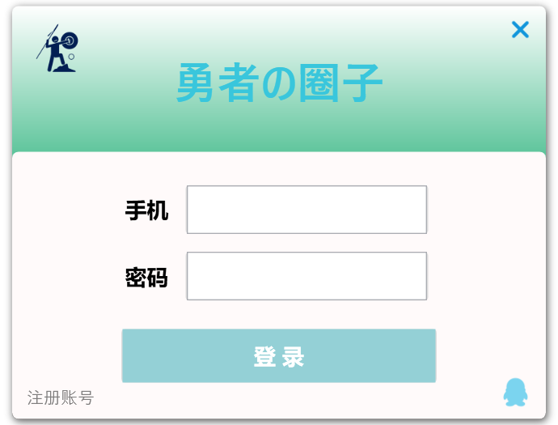

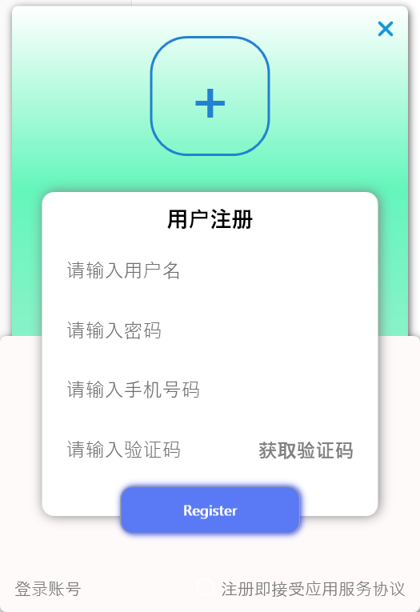

### AI 机器人对话

注册成功后系统自动添加 AI 好友 Robot，可直接发送消息进行对话。

### 搜索与添加好友

通过用户名搜索其他用户（支持模糊查询），点击查看个人资料，发送好友请求时可设置备注和验证消息。

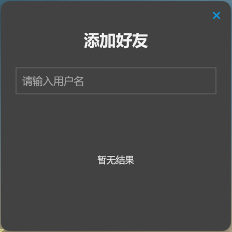
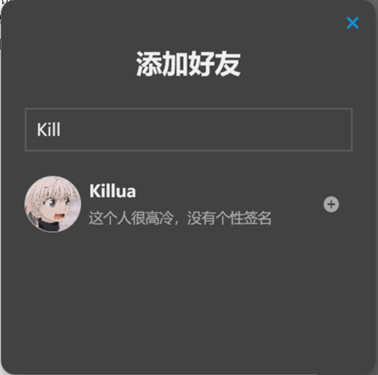
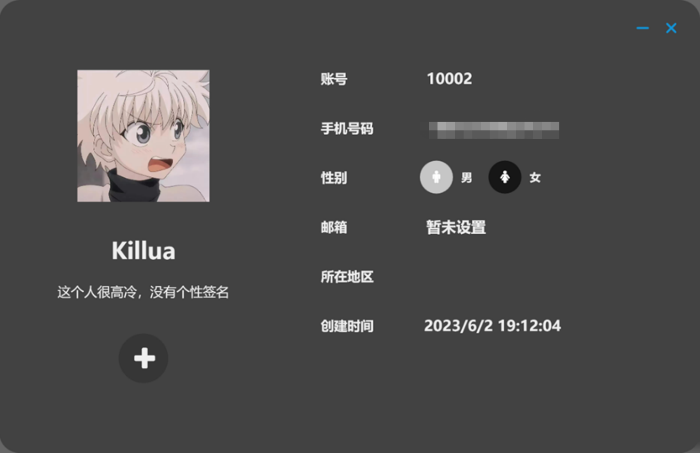

### 处理好友请求

在好友请求列表中查看收到的请求，可接受或拒绝，接受后可为好友设置备注名。

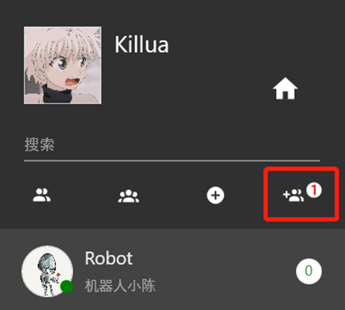

### 聊天与群组

好友列表以绿色/灰色圆圈标识在线状态，点击好友进入私聊，也可切换到群组列表进行群聊。支持搜索框按当前列表类型过滤好友或群组。

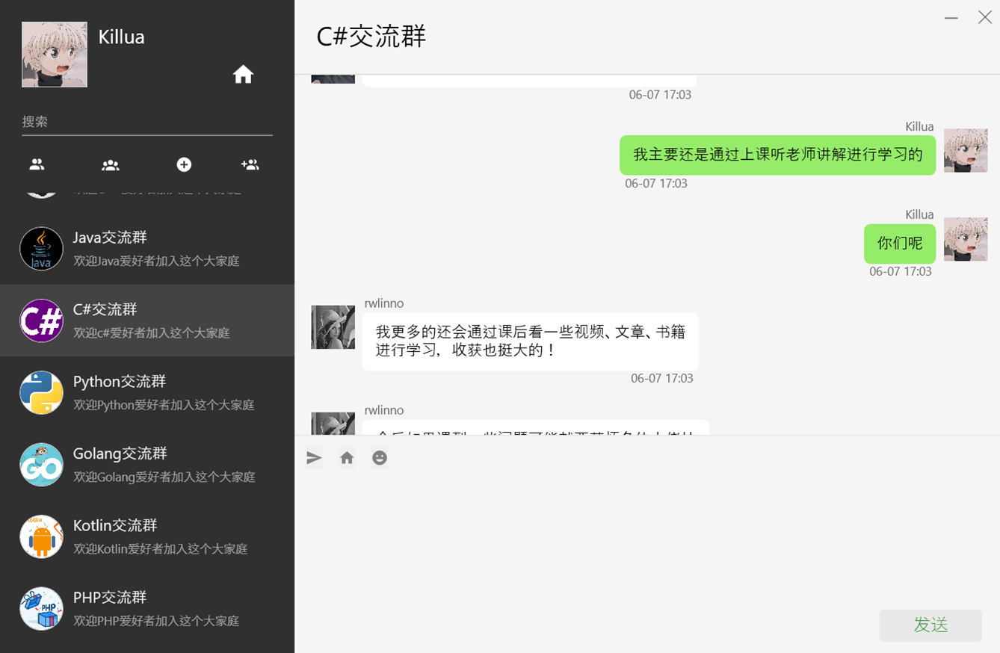

### 个人主页

可修改头像、用户名、个性签名、性别、邮箱、所在地区等信息，保存后实时同步到主界面。

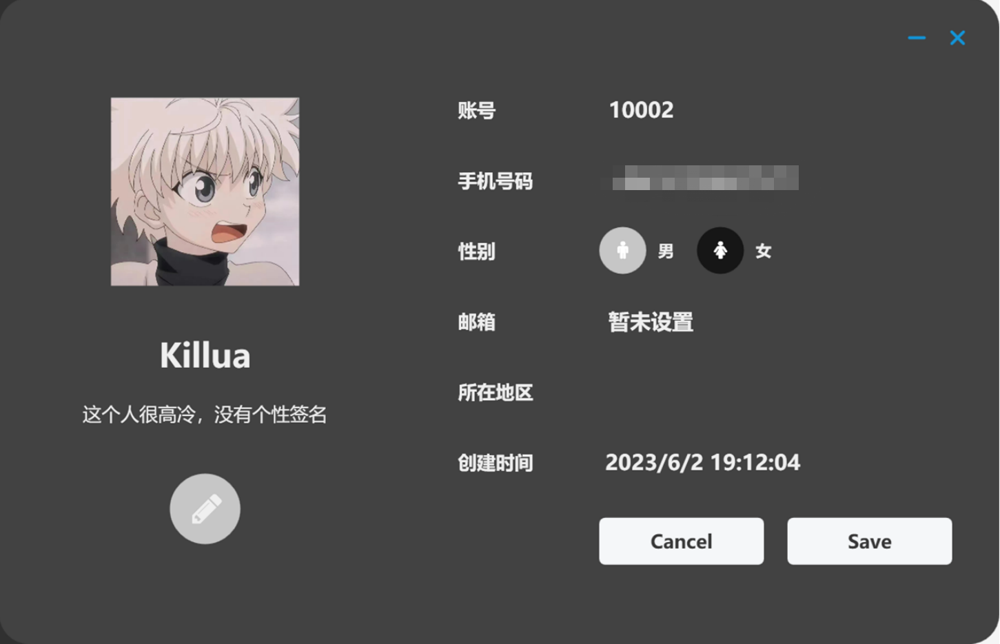

### 好友管理

右键好友可查看资料或删除好友，删除后双方同时移除，被删除方会收到提示消息。

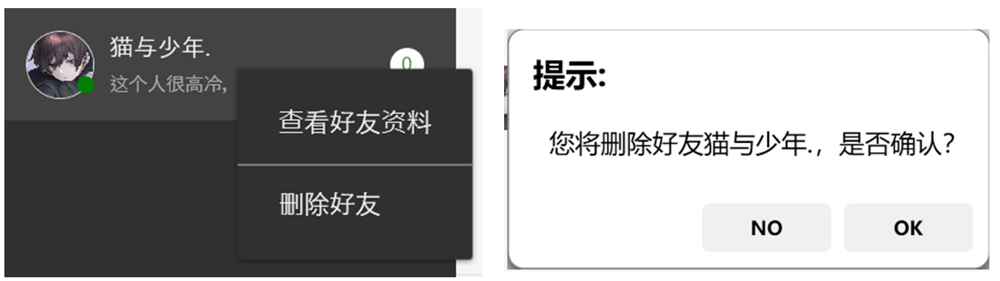
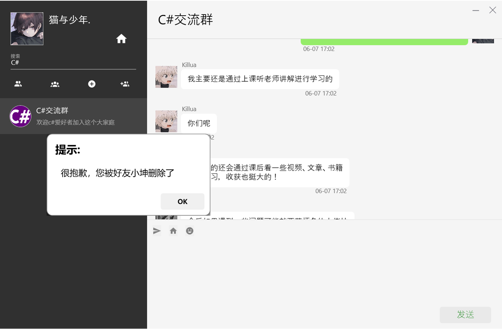

### 系统托盘

点击窗口关闭按钮仅最小化到系统托盘，通过右键托盘图标选择退出来关闭程序。

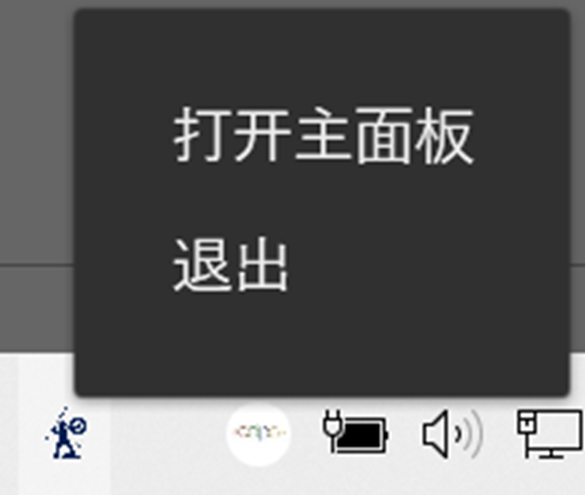
